# Vale Paiquerê: O Equilíbrio das Veredas

A terra não é um cenário estático; é uma força viva. No Vale Paiquerê, cada linha de código traça a fronteira invisível entre a prosperidade do campo e a ruína do ecossistema.

Bem-vindo ao **Vale Paiquerê**, um ecossistema digital projetado não apenas para expor dados, mas para testar a sua capacidade de manter o mundo de pé. Este portal híbrido de jogo e informação foi desenvolvido para a subcategoria 3 do Programa Agrinho 2026, sob o tema *“Agro forte, futuro sustentável: equilíbrio entre produção e meio ambiente”* para mostrar a realidade agrícula de nosso estado.

Aqui, a separação tradicional entre homem e natureza desaparece. O site divide-se em duas camadas simbióticas que convidam você à exploração:

---

# Sobre o Desenvolvedor:

° **Autor:** Maicon Sandriel Ojeda da Rocha;

° **Mentor:** Ciro Pereira Rosa;

° **Município:** Tomazina – Paraná;

° **Escola:** Colégio Estadual do Campo Antônio Batista do Nascimento - EFM.

# Referências

° **Crédito ao artista do ícone do Flaticon:** mpanicon   —  https://www.flaticon.com/authors/mpanicon

### Foi Feito Como Base os seguintes Sites:

° **G1:** https://g1.globo.com/

° **Poki:** https://poki.com/

° **Site de Meu Irmão:** https://stopcar-2m7sw6e9.manus.space

---

# Origem do Site:
Projeto desenvolvido para o Concurso Agrinho 2026 – Categoria Programação, na Subcategoria 3: Programação Front-End – HTML, CSS e JavaScript.

---

# Tema do Concurso
Agro forte, futuro sustentável: equilíbrio entre produção e meio ambiente.

---

## Objetivo do Projeto

O objetivo do **Vale Paiquerê** é arrancar o debate ambiental dos clichês ecológicos e das cartilhas estáticas. Utilizando uma interface *mobile-first* limpa e responsiva (arquitetada para resistir até os limites críticos de **320px** e modo paisagem), o projeto prova que a tecnologia pode ser uma ferramenta de expressão artística e conscientização crítica.

**O Vale está pronto, o console está limpo e as variáveis estão zeradas.** 
Role a página, faça suas escolhas, mude o tema visual se a noite cair, e descubra se o seu olhar é capaz de construir um futuro sustentável ou se restará apenas o limbo do esgotamento.

---

# Instruções de Uso

## Conversa com a Gralha-Azul

**1.** Preencha seu nome no campo informado.

**2.** Aperte o botão ao lado.

**3.** Leia atentamente o que ela fala, pois será exencial mais tarde.

## Jogo

**1.** Inicie o simulador clicando no botão de início na seção do jogo.

**2.** Leia atentamente o dilema apresentado pela Gralha-Azul.

**3.** Deite a tela mpara uma melhor experiência — caso você queira.

**4.** Escolha uma das duas alternativas disponíveis para começar a bola de neve.

**5.** Monitore os impactos e tente equilibrar a produção e a preservação ambiental até o desfecho.

### Manual do Jogo

**1°**  Leia o objetivo e mecânica;

**2°**  Role/deslize para baixo para chegar ao card jogar;

**3°**  Caso queria voltar ao manual, você precissará pressionar o botão amarelo — com o ícone de um livro — que terá acesso a tela do manual. 

---

# Ferramentas usadas:

As ferramentas estão mencionados no próprio site — de forma elegante — que ao pressionar o respectivo nome dele você — visitante — será encaminhado diteramente a aba do site/aplicativo usado.

° **VScode:** https://code.visualstudio.com/

° **Canva:** https://www.canva.com/

° **Piskel:** https://www.piskelapp.com/

° **ChatGPT:** https://chatgpt.com/

° **Gemini:** https://gemini.google.com/

° **flaticon:** https://www.flaticon.com/

---

# Funcionalidades do Site

° Página inicial com temática dinâmica (Dia/Noite);

° Menu de navegação responsivo (mobile-first);

°  Motor de RPG Narrativo estruturado em JavaScript;

° Efeito visual de vagalumes e elementos naturais;

° Sistema de decisões ramificadas — 32 desfechos possíveis;

° Ala teórica detalhada;

° Alternância automática de temas visuais via JS;

° Estrutura otimizada para acessibilidade;

° Layout responsivo — testado de 320px até desktops.

---

# Tecnologias Utilizadas
O projeto foi desenvolvido utilizando tecnologias fundamentais de front-end:

° **HTML5:** Estruturação semântica;

° **CSS3:** Estilização, variáveis var() e responsividade;

° **JavaScript:** Lógica do simulador, controle de temas e estados.

---

# Experiência de Jogo

O "Vale Paiquerê" utiliza uma lógica de RPG narrativa. O usuário assume o controle através de decisões sobre o manejo da lavoura, o uso de defensores e a proteção das águas. Cada escolha altera variáveis internas, conduzindo a história para um dos 32 desfechos possíveis, dependendo da sustentabilidade das ações tomadas.

---

# Prompts:

Sobre os prompsts foram vários — especialmente no ínicio que meu conhecimento era mais breve. Documentados ao percorer dos dias, você tem acesso a todos os prompts: documentados no diário de bordo.

---

# Resumindo a Introdução

O "Vale Paiquerê" é a prova de que a lógica da programação, quando unida à sensibilidade literária, transforma linhas de código em narrativas vivas. Mais do que um projeto de TI, é um exercício sobre como observamos o mundo e as escolhas que fazemos para garantir um futuro onde o agro e a natureza coexistem em equilíbrio.

---

# Saiba mais:

A partir deste ponto, você estará na ala da documentação, onde o assunto é mais profundo e aborda o meu passo a passo e dia a dia. É aqui que se une o formal ao informal do diário de bordo — onde se localizam os prompts usados e o desenvolvimento próprio/criativo. Caso tenha alguma dúvida, leia, confira como o site era nos primeiros dias e ignore a simplicidade estrutural, pois o foco da documentação a seguir é na informação e na rotina. Por isso, poderão ser observados erros de gramática da língua portuguesa. Aproveite a documentação! Pois, a partir do diário de bordo, estarão as ilustrações e a documentação mais simplificada visualmente.

---

# Documentação de meu progresso:

__Dias trabalhados:__ 21 dias

__Dias documentados:__ 15 dias

__Dias Levados:__ 33 dias

**Inicio e fim do projeto:** 28/04/2026 - 28/05/2026

**Sobre a documentação:** Usei a linguagem formal e informal juntas, devido a esta documentação se passar como um diário de bordo, registrando progressões, emoções e sinceridade sobre o assunto. O projeto foi feito sob os requisitos do edital distribuído — sigam para saberem mais sobre minha progressão e aprendizados.

**A Respeito da Inteligência Artificial (IA):** Utilizei a IA como uma ferramenta de produtividade — conforme ensinado nas aulas da Alura — mas a lógica de navegação, a correção de bugs e a identidade visual única do Vale Paiquerê foram totalmente frutos do meu refinamento manual e decisão criativa própria, seguindo mais tarde os conselhos distribuídos pelas aulas da plataforma Alura.

---

# Resumo Semanais:

## Semana 1: 28/04 a 04/05 — Dias 01 a 07

**Foco:** Estruturação da Interface e Identidade Visual.

**Resumo:** Período dedicado a erguer o esqueleto essencial do site Vale Paiquerê. Foi criado o cabeçalho fixo e o menu compacto (hambúrguer) para celulares e tablets. A área de informações recebeu seus primeiros textos e imagens conceituais sobre sustentabilidade e tecnologia no campo. Também houve o reaproveitamento de códigos e artes da Gralha-Azul de um projeto anterior para otimizar o tempo de desenvolvimento.

## Semana 2: 05/05 a 11/05 — Dias 08 a 14

**Foco:** Pausa Criativa e Ajustes de Escopo.

**Resumo:** Intervalo voltado ao descanso e à produção escrita (literatura). No código, o tempo foi usado para planejar mentalmente a complexa árvore de decisões do jogo. Na reta final da semana, foi realizada uma manutenção crítica na seção da Gralha-Azul para corrigir falhas de quebra de layout em telas de smartphones (600px).

## Semana 3: 12/05 a 18/05 — Dias 15 a 21

**Foco:** Automação, Acessibilidade e Robótica.

**Resumo:** Implementação do sistema de paleta de cores dinâmica através de variáveis CSS — var() — e criação de um script em JavaScript que altera o tema do site (dia/noite) automaticamente com base no relógio do usuário. Desenvolvimento da interface inicial do jogo (barra de ferramentas, manual integrado e efeito visual de "véu").

## Semana 4 e Reta Final: 19/05 a 28/05 — Dias 22 a 33

**Foco:** Matriz de Escolhas, Solução da "Anarquia Mobile" e Polimento.

**Resumo:** Fase mais intensa do projeto. Programação de toda a lógica exponencial de caminhos e consequências do game (1, 2, 4, 8, 16 caminhos), acompanhada da escrita manual de cada diálogo e geração de imagens realistas para os desfechos. O layout passou por uma reconstrução responsiva severa para salvar a interface de celulares de uma "semi-anarquia" visual — poluição visual total. Para manter o site limpo em telas menores, as imagens das laterais foram removidas em smartphones e compensadas com um efeito sutil de vagalumes e copas de araucárias. Projeto concluído com a inserção dos créditos autorais e a logo institucional da escola.

---

# Os três aprendizados que levarei para minha vida:

**1°:** Não desenvolver sites por um longo período.

**2°:** Evitar linguagens de programação — especialmente JavaScript.

**3°:** Ironia a parte, eu aprendi que a lógica da programação não se define em linhas escritas em JavaScript, mas se define ao reescrever como observamos o mundo afora. Descobri que a lógica que eu tanto temia, é apenas uma gramática mais sofisticada que me permitiu transformar o limbo esbranquiçado do site, em uma aba cheia de pensamentos concretizados.

**O que aprendi?** 
Que a frustação de um bug é apenas um sinal de uma nova jornada que estou prestes a trilhar — sem medo de errar dessa vez.

**O que Guardarei para Minha Vida?**
Que, independentemente da direção que eu siga, eu não me defino mais como a mesma pessoa que começou esse projeto. O fardo que eu carregava, agora me dá a capacidade de dividir problemas em fragmentos de frustrações, emprestando-me coragem para construir algo do zero, palavra por palavra — comando por comando.

— Afinal, a tecnologia é apenas a ferramenta que pude desfrutar; enquanto o meu olhar é o que realmente cria as coisas.

---

# Um Minutinho de sua Atenção como Avaliador:

# 1° Sobre os erros:

bugs têm sido caçados cuidadosamente, dia após dia, hora após hora. O site funciona sem erros ou bugs aparentes em telas a partir de 320px (o mínimo testado e aprovado) até em telas mais amplas, como tablets e computadores.

# 2° Sobre a nomeação das pastas:

compreendo que, no padrão digital, nomes de pastas com caracteres especiais ou espaços podem causar falhas críticas. No entanto, garanto que o projeto está funcional e respeita rigorosamente a diferenciação entre maiúsculas e minúsculas (case-sensitive). Alterar a estrutura de endereçamento agora demandaria um retrabalho excessivo devido à forma como os arquivos já estão hospedados no Git. Quanto às pastas "CSS" e "JavaScript", elas foram estruturadas assim porque, no início, o plano era criar um projeto mais complexo, com arquivos separados para o jogo (game.js) e para o site. Foi um erro de iniciante — que agora compreendo — mas com o projeto já avançado, optei por manter a estrutura para não comprometer o que já estava funcionando.

# 3° A Respeito de meu desenvolvimento:

Como mencionei, sou da área de Humanas. Não por falta de afinidade com a lógica, mas por paixão pela literatura. Embora eu aprecie padrões e tenha facilidade em resolver problemas técnicos, sinto certo desânimo quando preciso lidar repetidamente com os mesmos erros preferindo dedicar minha energia à criação de algo novo — descobri mais tarde que eu estava errado, pois a programação é apenas uma gramática mais sofisticada. Apesar disso, ainda pretendo seguir a carreira de escritor e professor de Letras. Participei deste concurso porque, apesar dos desafios técnicos, a lógica me atrai e reconheço minha capacidade nesta área. Contudo, minha essência prefere contar histórias, construir mundos e descrever estados sentimentais — mais amplo do que escrever comandos.

---

# Diário de Bordo:

# Dia 01 — 28/04/2026

__Resumo:__ Hoje estabeleci o básico do site, defini onde ficará cada elemento e coloquei uma coloração temporária — que logo mudarei. O inicio é rápido, ainda mais com a assitencia da IA para apoiar em etapas mais fáceis, poupando tempo para o trabalho bruto que ninguém faz igual — design e ilustrações.

__Atividades feitas no dia:__

— Estabeleci a base do site.

— Escolher com cuidado a posição de cada elemento.

— Começar a fazer o ajuste para aparelhos menores.

— Escolher a estética do site — escolhido, mais ainda não aplicado.

— Fazer um modelo de registro/documentação de meu processo

__Uso de IA e Decisões Técnicas__

— __Prompt(s) Utilizado(s):__

— **Prompt 1 - Estrutura Base:** Crie a estrutura inicial de um site chamado "Vale Paiquerê", respeitando as regras de semântica e organização de arquivos (HTML, CSS e JS) do edital. O design deve ter um cabeçalho (aba) totalmente verde e, logo abaixo, uma "cortina" de divisão em cor marrom que combine com o verde. Esta identidade visual deve se manter consistente durante a rolagem da página. Foque em gerar um código funcional e fiel às normas técnicas, repito, focando totalmente nesses mandados — nada mais nada menos.

— **Prompt 2 - Expansão de Conteúdo:** Aumente a profundidade de rolagem do site para incluir uma seção de informações abaixo da área do jogo. Esta seção deve conter blocos de texto e espaços reservados ("cupinhos") para futuras ilustrações, seguindo as referências visuais enviadas. Desenvolva o código desta parte de forma isolada e modular para evitar erros de integração, garantindo que o layout seja organizado e facilite a leitura dos textos informativos.

— __Refinamento manual:__ Ainda que a gemini (IA utilizada) tenha comprido certinho o mandando, acabou cometendo erros de coloração, ID alternado, posições fora do lugar desejado (único ponto que ela não tinham culpa, admito) e alguns códigos estavam juntos dentro da mesma seleção, resultando em quando fui mudar alguma posição, todos mudavam.

Um exemplo claro é esse aqui: O código apresentava erros quando a linha de devisão estava empurrando demais informações, logo percebi isso no código e informei a gemini, porém ela vaio com papo de "O erro deve estar nos IDs ou arrume posições tal." Sabe a verdade? Não era nunhum desses erros, era até simples demais para ela ter errado: o erro consistia no ato de ela ter unido o código da ala de baixo com a formação da linha, em outras palavras, quando eu movia a linha de devisão, eu estava movendo o conteúdo inteiro de baixo. Resolvi facilmente, só retirei da seleção do conteúdo de baixo e abri uma nova seleção. Simples e prático.

Como disse, eles fazem o trabalho tecnico bruto, mas quem deve modelar a estrutura e refinar é você próprio.

__Próximo passo:__ Meu intuito seria analisar mais sites para pegar um resto de referencias que faltam, mas do jeito que está já me satisfaz — sites que visitei foi do poki que é de games e alguns de jornal, mas eles estavam faltando o disign da minha aba web. Afinal, em resumo estou pensando em começar a dar forma nesse esqueleto, adicionar uns detalhes para depois começar o mais díficil, o jogo — caso tenha kkkk, talvez eu não coloque.

__Nota:__ Hoje foi mais produtivo por alguns motivos simples: primeiramente é a parte mais fácil, fazer a base do site se faz em horas, não dias, por isso que foi rápido. Outrossim é o fato de eu ter começado outros dois projetos do mesmo asunto, porém como podemos observar esse é o que está tomando mais forma desde então — foi útil para compreender o funcionamento do site, ajudando na lógica que estava faltando.

Em conclusão, a IA ajuda a formar a base do código, mas elas ainda não sabem refinala, sobrando o papel para mim fazer. Outro ponto é que eles não sabem criar boa imagens ou textos, resultando novamente em minha mão de obra, que estou pensando em usar pixel art ou desenho em papel — online. Na real o problema do desenhado online é que não tenho nem tablet ou algo do genero para facilitar... o uso de pixel art está na frente já kkk. Espero que eu continue animado assim. 

__Imagem(s):__

    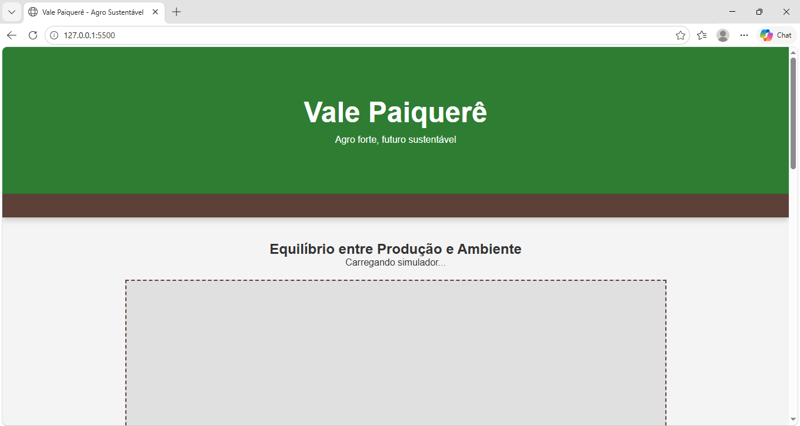
    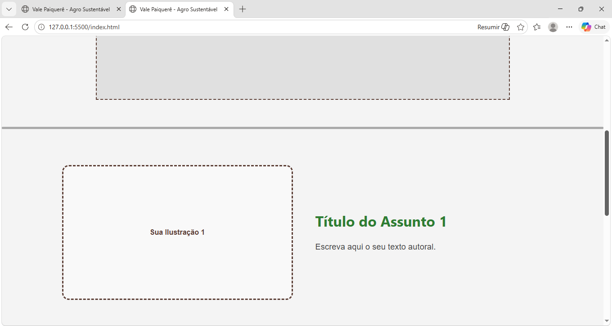
    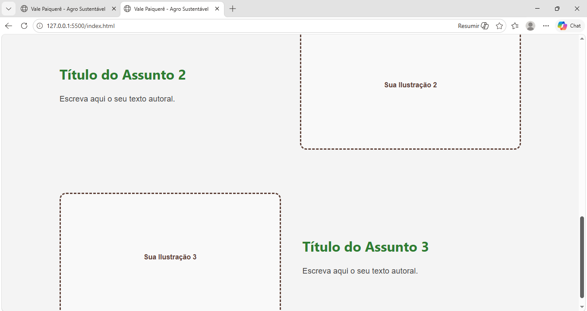

---

# Dia 02 — 29/04/2026

__Resumo:__ Hoje, acabei arrumando um erro que foi chato em minha opinião, pois ele consistia na adaptação do site em celulares e tablets — depois explico melhor. E estou quase terminando o esqueleto do site, eu falei que tinha terminado, mas agora eu falo que não, porconta que eu desejei mais coisas, que no resultado de tudo, falta fazer — eu acho — só mais uma adição para começar a polir o site para finalmente começar o game.

__Atividades do dia:__

— Adicionar um rodapé final onde ficará os créditos/ferramentas usadas.

— Criar um rodapé fixo, no qual estará os atalhos, nome do site e logo.

— Ajeitar tal cabeçalho para o formato de celular/tablets, que necessitam de um botão de menu para a tela não ficar poluida com o nome dos atalhos na tela.

— Ajustar a proporção dos elementos antigos e atuais em telas menores — celulares e tablets.

— Colocar a função de atalho no menu do rodapé fixo.

— Arrumar bugs e testar combinações que provavelmente ninguém vai testar, mas se eu não arrumar provavelmente vão esbarrar naquilo e vai falar que eu não revisei o código e o projeto que tem muito bug para ser aprovado plaplapla... afinal, arrumar bugs.

__Uso de IA e Decisões Técnicas:__

— __Prompt(s) Utilizado(s):__

**Prompt 1 — Créditos as ferramentas:** 
Focando totalmente no rodapé — abaixo das informações detalhadas —faça mais uma linha de ponta a ponta (esquerda a direita) e abaixo dessa linha estabeleça quadrados onde estará as imagens dos apps/logo delas, e na frente uma área de texto para colocar o nome delas. Foque totalmente nesses comandos, respeitando as normas do edital que eu te mandei no início da conversa. Entendido?

**Prompt 2 — Ajuste nas telas de celulares e tablets:** 
Agora vamos ajustar o tamanho nas telas de celular, focando totalmente nesses comandos apenas, lembra como o de pc é? então, nesse site pretende ser igual, se está muito grande diminua para ficar igual ao de pc entendido? assim, a parte de informação a imagem e ao lado o texto, a caixa de game retângulo e os créditos enfileirado com 3 colunas, entendido?

**Prompt 3 — cabeçalho fixo superior:** 
Focando totalmente na criação desse comando a seguir: faz um cabeçalho de mesma cor #2E7D32, aqueles cabeçalhos um pouco que finos pois é aquele cabeçalho que aparece quando se rola para baixo, nesse tal cabeçalho desejo um quadrado no canto da esquerda (onde vou colocar a logo de minha escola), logo ao lado escrito vale paiquerê. Na direita seguintes nomes: inicio, introdução, jogo, sobre, créditos. Enquanto no celular/tablet por enquanto será um quadradinho pequeno no conto direito desse cabeçalho superior, na qual quando clicado/pressionado abre um mini menu onde estará esses atalhos que comentei.  Lembrando que o que eu estou pedindo aqueles cabeçalhos fixos, aqueles onde fica os atalhos para demais áreas do site, assim como nomeei os nomes que terá o site eles quando pressionados devem levar para suas respectivos locais (o jogo para aquele retângulo onde estará o jogo, Inicio que é onde está a aba verde, introdução onde ainda vou fazer, sobre onde estão as informações mais profundas sobre e créditos onde estás aqueles quadradinhos) sabendo disso, fa zum código funcional respeitando meu código e as normas da edital do agrinho. Lembrasse, um cod funcional.

— __Refinamento manual:__
Mesmo tendo o trabalho bruto como já comentado, foi pressiso ajustar algumas coisas como os Ids e as class, a posição dos elementos e arrumar alguns bugs presentes no código, que a IA faz questão de ignorá-los.

Uma deses ajuste que eu fiz/bug presente, estava no ato de... pera esqueci, lembrei. Era a parte de ajustar a tela dos aparelhos menores, que acabou-se sendo estressante porque a gemini esqueceu de colocar um outro class ou Id — não me lembro ao certo — que estava travando uns elementos. Afinal, acabou levando uns 10 minutos meu (só nesse bug, teve muito mais!), pois eu achava que o erro estava no ID de um só elemente — nem pensava que era a falta de mais um. Acabei resolvendo rapinho até, o que demorou mesmo fui o motivo dele estar no inicio do comando, então eu nem imaginava kkkk pois estava indo tudo certinho desde então.

__Próximo passo:__
Amanhã vou terminar de fazer o esqueleto para começar a fazer a ilustrações, textos, pegar imagens (que eu vou mencionar de onde peguei, não se preocupe. E também eu prefiro eu mesmo fazer ao invés de pegar do outro), infeites, em geral, começar a dar vida para esse site branco.

__Nota:__
Eu achei o dia progresor, porém tenho que resaltar que o fato de eu ter ficado quebrando a cabeça para resolver alguns bugs simples que eu não sei como que eu não tinha visto, acabou me atrassando minimamente, mas o suficiente para mim não ter tempo de continuar — porquê eu tenho aula e após o site tenho que fazer esse documentário de minha progresão diáriamente. Sinto que meus prompts estão melhorando, ainda mais o 3° desse dia, mas o tamanho dele e a quantidade de pedidos acabou fazendo eu trabalhar mais kkkk. Imagine qunado eu estiver fazendo o game? Não vejo a hora de ver eu mesmo quebrando mais ainda a cabeça kkk.

__Imagem(s):__ Escolhi em quadarmenteo 400:600 pois já mostra como está ficando o site no celular junto aos novos elementos adicionados.

    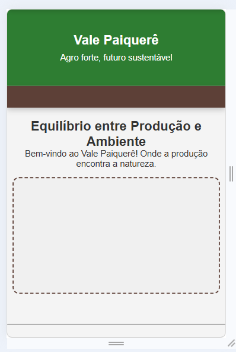
    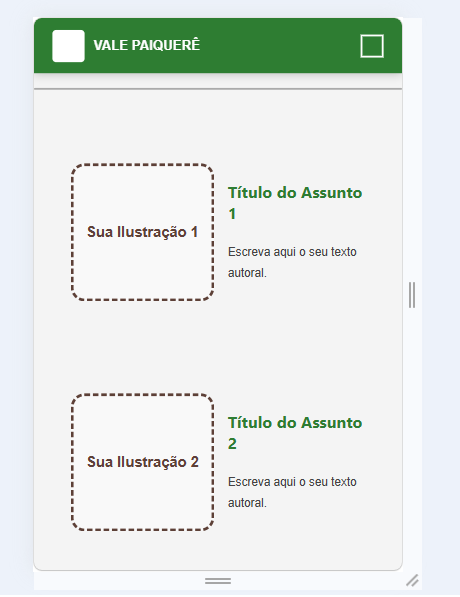
    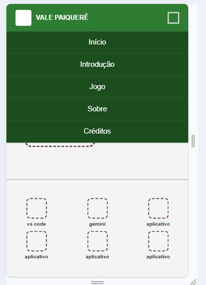

---

# Dia 03 — 30/04/2026

__Resumo:__ Digamos que hoje foi produtivo, comecei a alterar aqueles quadrados acinzentados por imagens vivas e "bonitas" eu diria, e colocar textos na quelas áreas em branco. Coloquei a logo de nossa escola no cabeçalho fixo e troquei a imagem quadrada do menu, por uma que o site flaticon prospos — eu acho que será a única vez que vou usar nesse projeto, pois no game, eu prefiro fazer. Afinal, comecei a dar corpo definitivo para o site.

__Atividades do dia:__

— Fazer três (03) textos para colaborarem na áras das informações.

— Pedir para a gemini criar imagens para colocar naqueles locais — seguindo meus prompts.

— Modificar o quadrado branco pela logo de minha escola.

— Trocar o quadrado do menu por um circulo de menu do site flaticon.

— Arrumar os quadrados pontilhados para serem linhas sólidas em preto — ao invés de marrom.

— Ajustar os códigos e arrumar os bugs de proporção das imagens.

— Alterar as proporções dos celulares para não ficar poluido; mesma coisa para os tablets, que irão seguir a mesma estética do pc, porém menores (não consegui testar igual ao celular, pois não tenho tablet... vou pedir enprestado da escola por uns minutinhos).

— Revisar tudo que fiz hoje.

__Uso de IA e Decisões Técnicas:__

— __Prompt(s) Utilizado(s):__

**Prompt 1 — retângulo da introdução:** Agora vamos focar em fazer a parte da introdução onde ficará um vídeo animado falando sobre o equilíbrio. Como os demais, vamos fazer um retângulo (deitado) com a mesma estética que os demais. Entendido?

**Prompt 2 — O Equilíbrio e o Ciclo:** Uma cena dividida ao meio: de um lado uma plantação tecnológica verde e saudável com drones, do outro uma cidade moderna com engrenagens e símbolos de reciclagem. No centro, uma balança equilibrando uma folha e um chip de computador. Estilo 3D isométrico, cores verde e branco, iluminação suave.

**Prompt 3 — Tecnologia e Natureza no Campo:** Mão de um robô ou interface digital flutuando sobre uma plantação de soja, mostrando gráficos de umidade e dosagem exata de nutrientes. Ao fundo, um rio cristalino e preservado. Estilo moderno, cores vibrantes, foco em sustentabilidade e precisão.

**Prompt 4 — O Upgrade Agrinho:** Um laptop aberto em um campo de trigo, na tela códigos de programação (HTML/CSS) saindo como se fossem plantas crescendo. Ao redor, ferramentas de prototipagem e o logo do Agrinho. Estilo arte digital futurista, mistura de natureza com elementos de hardware e software.

— __Refinamento manual:__ Hoje não teve tanto refinamento manual dos códigos da gemini, pois hoje eu teria que mexer com linhas de comando já feitos, a IA iria só atrapalhar. Ainda sim, tenho que admitir que teve duas vezes que recorri a ajuda dela, era a parte para o vídeio que ainda vou colocar sai-se suave — um preparo adiantado — e como colocaria um video no site — desses dois assuntos eu não sabia, admito.

Como sempre, tive minhas dúvidas e difículdades, mas nada que me levou mais de horas para resolver, pois ter assistência da IA as vezes ajuda, outras vezes piora tudo.

__Próximo passo:__ Amanhã vou fazer a parte do Inicio ou introdução — já que terminei a ala das Informações. Vou deixar os créditos e jogo por último por motivos óbveis, os créditos por conta das ferramentas que ainda vou usar, enquanto o jogo é pelo motivo de ser mais complicado, porquê tenho que fazer as ilustrações, história e mecânica tudo funcionando no pc, celular e tablet.

Antes de tudo, fazer o Inicio e a Introdução, após dos corpos modelados, vou dar um pouco de maquiagem — outras palavras, após defini-los, irei polir a estética do site.

__Nota:__ Hoje usei menos prompts de códigos, mas recompensei usando três (03) para gerar imagem. Outrossim, que não se deve usar IA para arrumar um código já elaborado, pois eles irão piorar tudo — recomendação salvar os cod antes de tudo ou decorar como estava tudo antes da IA colocar seu dedo.

__Imagem(s):__ Como o cabeçalho fixo e algumas funções do site é diferente depesendo do aparelho, tirei print na tela do meu celular e do pc.

    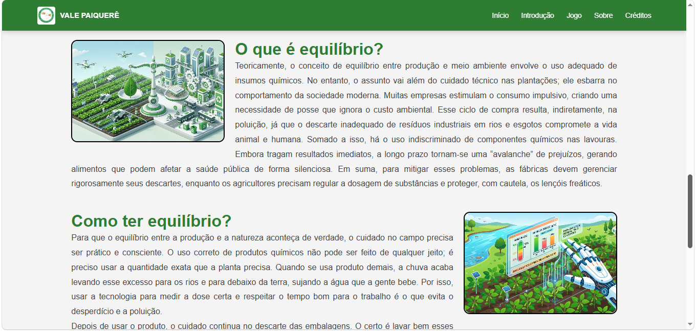
    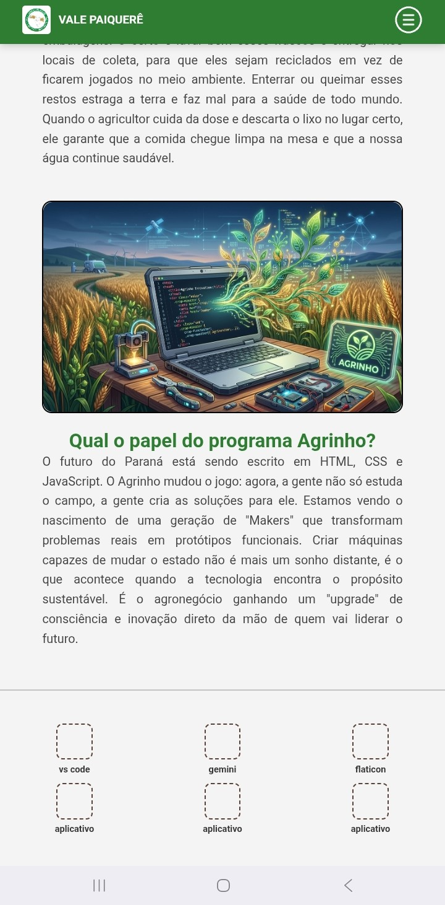

---

# Dia 04 — 01/05/2026

__Resumo:__ Hoje comecei a arruamar/modelar o inicio e a introdução, o inicio por enquanto está pronto — como os demais, falta apenas uns detalhes no design. Enquanto a introdução eu terminei parcialmente, pois falta arrumar o proporção para os celulares/tablets — não deu tempo pelo motivo que terei que sair, então se eu continuase não sobraria tempo para a documentação.

__Atividades do dia:__

— Começar a dar forma no inico.

— Ajustar o inicio no celulares/tablets.

— Começar a fazer a introdução.

— Fazer as artes da introdução.

— Fazer uma moldura para o retângulo da introdução.

— Reaproveitar um código de um outro projeto que falhou.

__Uso de IA e Decisões Técnicas:__

— __Prompt(s) Utilizado(s):__ Nenhum

— __Refinamento manual:__ Praticamente o refinamento foi de meu próprio código, pois o código que eu usei na gralha-azul (Html, Css e JavaScript) já estavam feitos — por mim mesmo dessa vez — em um projeto do agrinho também, mas o porém é que foi um dos meus primeiros projetos para esse concurso/programa, que como disse, acabei fazendo o site ficar muito pesado — adicionei muitos gifs, assim ficou pesado; além de estar todo bagunçado, afinal, não dava para continuar aquele site, mas dava para pegar um código com poucos defeitos que ainda estava funcionando.

__Próximo passo:__ Amanhã — se Deus permitir — vou arrumar para a tela dos celulares/tablets, arrumar uns bugs que não deu para arrumar hoje e... rufem os tambores... começar finalmente o jogo — o mais demorado e trabalhoso.

__Nota:__ Hoje aprendi que nunca se pode descartar nada, nenhuma imagem nem textos antigos, pois mesmo que dependendo do assunto que você estava usando não tenha dado certo, pode dar certo em outros projetos — Isso me poupou tempo, pois eu peguei o código e imagens da gralha-azul de um projeto com falha nos comandos.

Hoje até a documentação está sendo rápido kkkk, porque está quase na hora de sair!

__Imagem(s):__ As imagens monstram o que eu fiz hoje, onde fiz o molde de cipo (gralha e botão) e o bug/faltou tempo para ajustar algumas coisas.

    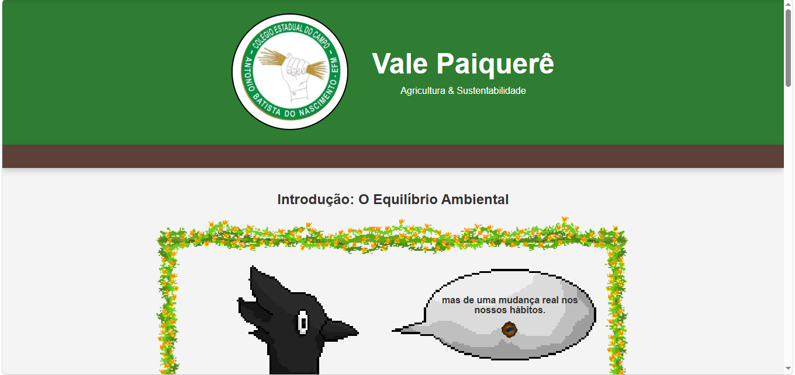
    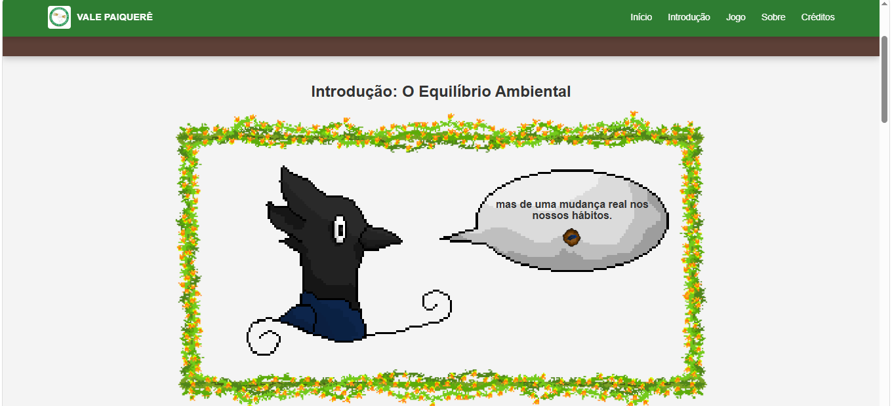
    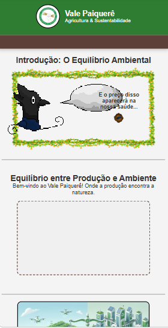
    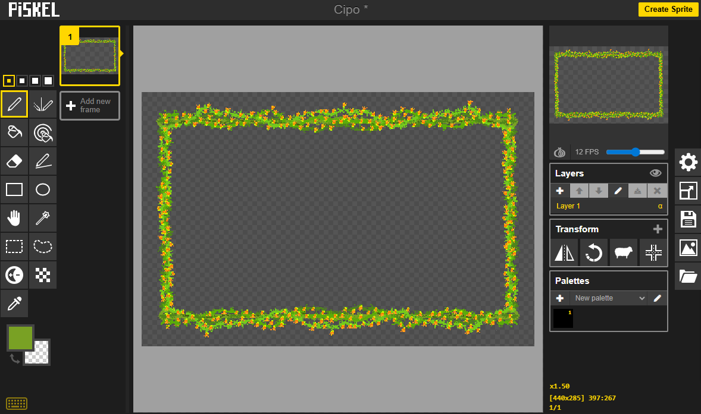

---

# Dia 05/10  — 02/05/2026 - 07/05/2026

__Resumo:__ Durante esses dias eu acabei parando um pouco o projeto, pois eu queria dar uma descansada, porém acabei me aprofundando/descansando demais no meu passa tempo — escrever. Mas agora vou focar pelo menos amanhã no projeto.

---

# Dia 11 — 08/05/2026

__Resumo:__ Hoje corrigi o bug da gralha-Azul, e comecei a planejar como será o jogo.

__Atividades do dia:__

— Arrumar os bugs.

— Mudar um pouco o roteiro para os celulares, pois estavam desproporcionais para telas 600px.

__Uso de IA e Decisões Técnicas:__ 

— __Prompt(s) Utilizado(s):__ Nenhum

— __Refinamento manual:__ Apenas arrumar os bugs, levando em consideração minha demora devido ao fato que fiquei um tempinho sem mexer com o projeto, isso resultou na rigídez/mais trabalho em arrumar os prompts.

__Próximo passo:__ Fazer o jogo separado, no intuito de evitar problemas com códigos prontos, e também, com o foco total nele.

__Nota:__ Duas coisas. Primeiramente nunca ficar parado por muito tempo. Segundamente não queira arrumar problema onde á está funcionando — colocar uma nova lógica tipo o jogo. 

__Imagem(s):__

    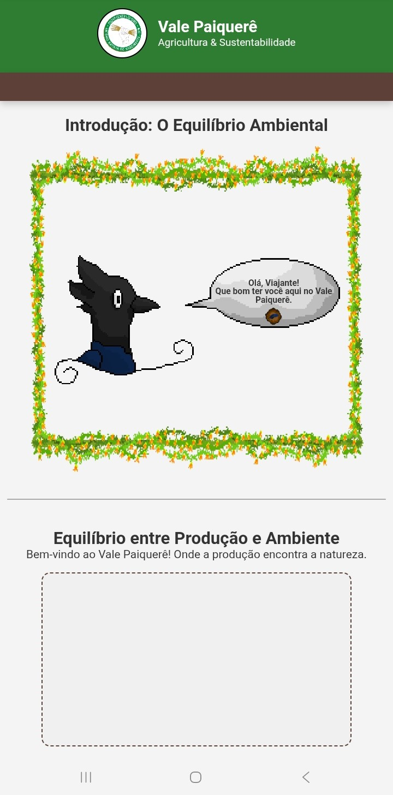

---

# Dia 12/15 — 09/05/2026 - 12/05/2026

__Resumo:__ Novamente acabei parando, pois devido a alguns trabalhos escolares e logo após, pessoais. Outrossim é o fato de que eu ainda não me estava imaginando o jogo que eu faria, sim, eu tenho a ideia, porém é complexa demais para eu realizar sozinho — por isso que estou pensando qual jogo eu abordo no projeto ou faço/carrego um video ou links. 

# **___Dia 17 — 13/05/2026___**

__Resumo:__ Hoje dei uma ajustada/uma maquiada podemos dizer, fazendo que o inicio ficasse bonito. Também não posso me esquecer que eu arrumei o botão de escurecer a tela, que me levou a elaborar um novo tipo de comando — apresentado pela gemini — sobre as variáveis CSS (eu acho que é esse nome, se eu não me estou enganado). Consistindo em separar tipo de cor com a ajuda do comando "var()", acabei nomeando e descobrindo um novo atalho (Ctrl + h) me ajudando a encontrar as cores escondidas no código.

__Atividades do dia:__

— Reaproveitar mais um desenho de copa de araucária.

— Colocar copas de araucárias no ínicio.

— Ajustar para celulares esse desenho de copa.

— Elaborar um botão de acessibilidade noturna e diária.

— Programar a lógica do modo escuro. 

— Trocar as cores claras por escuras; escuras por claras.

— Desencolver alguns sombreados para os moldes de fotos, títulos, cipó, e outros. 

— Estabeleser um comando que deixa o site em modo noturno as 17:30/18:00 (ainda não sei a hora certa) e claro/modo diário as 06:00.

— Realizar teste do comando do horário.

__Uso de IA e Decisões Técnicas:__

— __Prompt(s) Utilizado(s):__ Como eu acabo conversando muito com a gemini para retirar perguntas, acabei perdendo onde foi usado o prompt, então pedi para ela tentar encontrar onde estava o prompt que eu pedi para ela gerar o mecânismo da automção de dia ou noite:

— **Automação de Tema por Horário:** Você solicitou a criação de uma funcionalidade para que o site alternasse entre modo claro e noturno automaticamente, dependendo da hora do computador.

— __Refinamento manual:__ Sim, acabei perguntando muita coisa para ela, mas não para gerar tanto códigos, pois isso já é algo que sei, então apenas perguntei algumas coisas e fui fazendo o resto, como a alteração das cores para o var, ajustes de posições das copas, o sombreamento eu não sabia como ajustá-lo, mas após um conversa de uns 2-5 minutos eu compleendi a lógica e comecei a fazer sozinho — lembrando de um ponto crítico: eu sou bom em padrões, porém acho chato a programação, por isso que eu aprendo rápido porém me destraio rápido também.

__Próximo passo:__ Quer saber a verdade? Realmente estou perdido em meus pensametos, pois eu gostaria de fazer o jogo, porém estou com falta de animo em começar, e eu não posso ficar parado porquê qualquer um pode de passar ou já ter passado, então vou indo colocando detalhes no site para depois pensar no jogo — começo o jogo assim que me sentir a vontade.

Mas provavelmente amanã vou tentar arrumar o bug nos celulares e tablets, pois as proporções estão quebrados nesse aparelhos de 600px e minimamente fora do lugar em aparelhos de 900px.

__Nota:__ Mais você vai mexendo no código, mais erros/problemas aparecem. Sei que é o obvel, porém aprendi isso na prática.

__Imagem(s):__ As imagens a seguir mostra apenas no pc:

    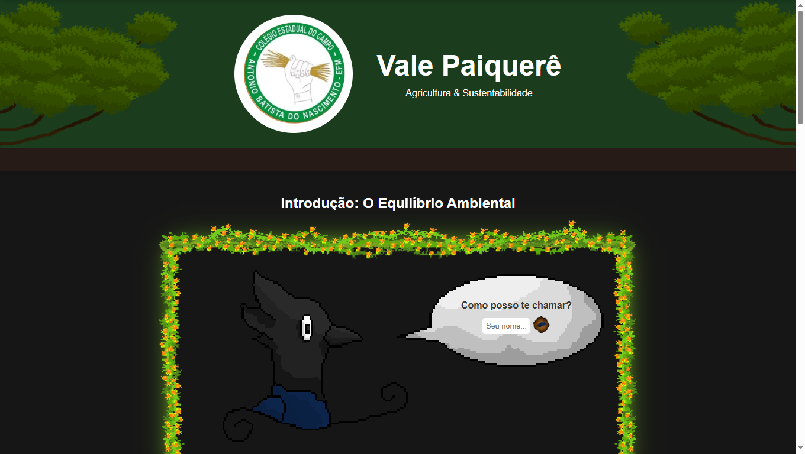
    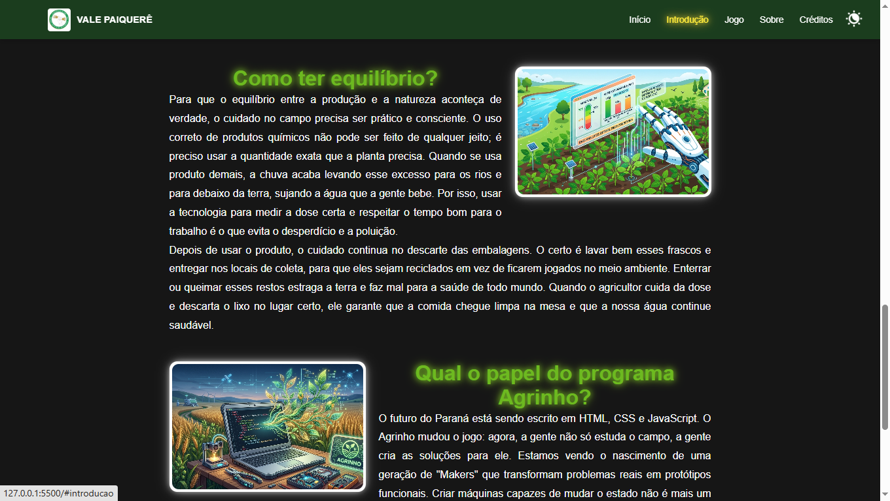
    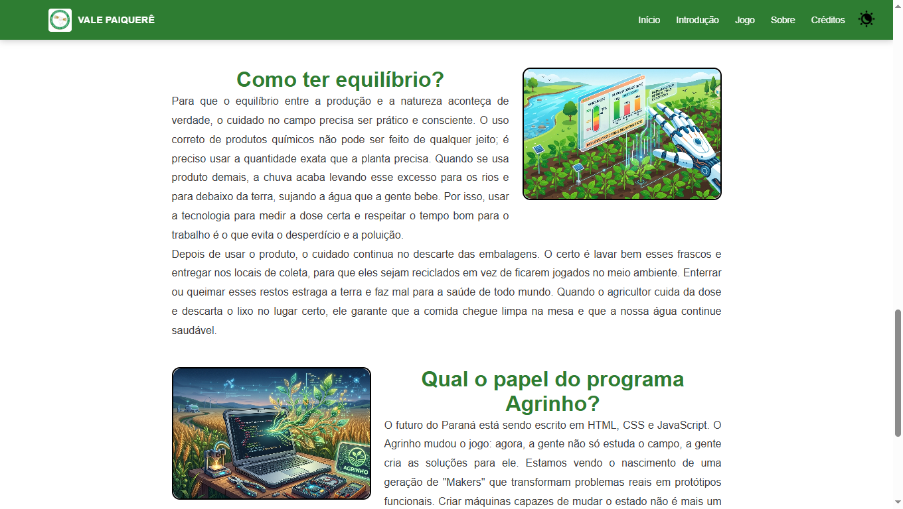

---

# Dia 18/21 — 14/05/2026 - 16/05/2026

__Resumo:__ Nesse período acabei focando em outras competições que esetavam atrasadas, como o agrinho categoria robótica, que acabei sendo encarregado por minha equipe em programar a lógica dos sensores PH e de turbidez. 
Além de algumas competições e seleções literários — pelo menos, a readação de minha parada do dia 09/05 me permitiu compor uma antologia. 

---

# Dia 22 — 17/05/2026

__Resumo:__ Hoje acabei resolvendo alguns bugs passados e adicionei uma nova animação no botão anoitecer, pois o visual antigo estava meio feio.

__Atividades do dia:__

— Arrumar os bugs passados.

— Adicionar um novo desing no botão escurecer.

__Uso de IA e Decisões Técnicas:__

— __Prompt(s) Utilizado(s):__ Nenhum.

— __Refinamento manual:__ Total, porque foi refinamento e pequenas alterações simples, nada de complicado.

__Próximo passo:__ Começar o jogo.

__Nota:__ Não deixar tudo para última hora.

__Imagem(s):__ Antes e depois dde resolver o bug:

    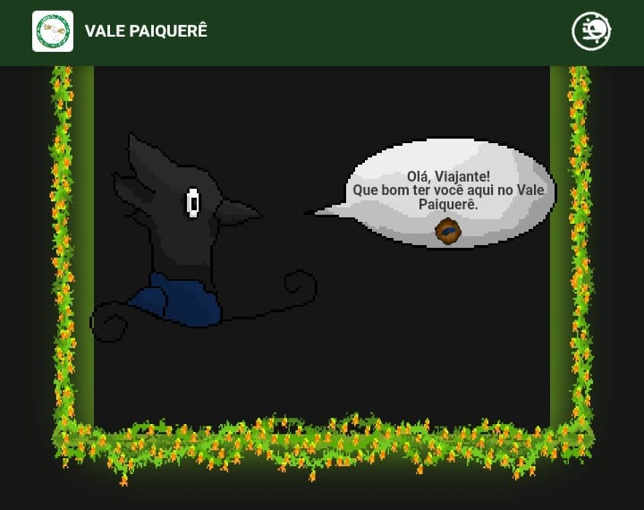
    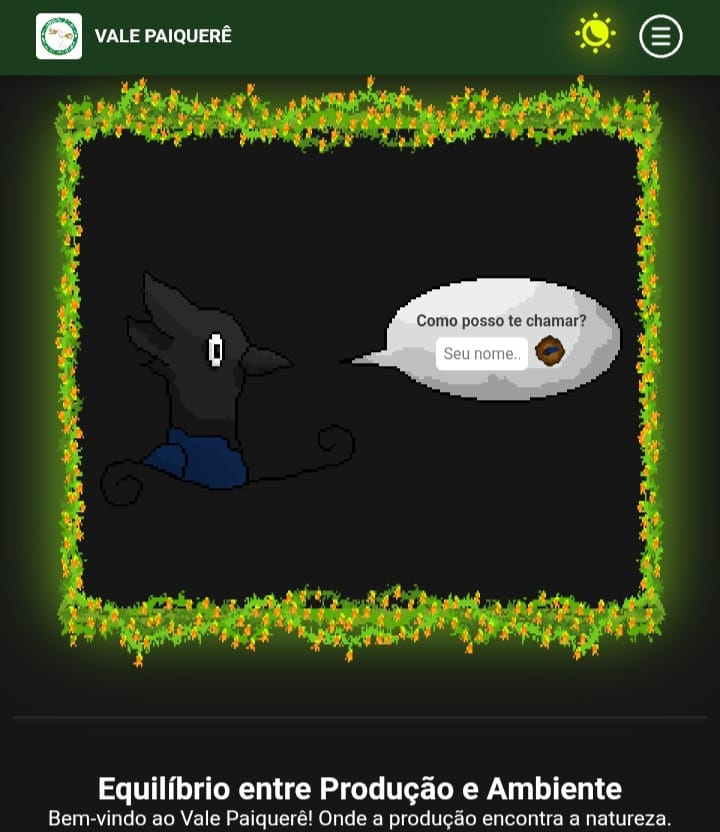

Desculpe por hoje, mas estou meio desanimado devido ao dia.

---

# Dia 23 — 18/05/2026

__Resumo:__ Hoje comecei a fazer a base do jogo, como a barra de ferramentas (manual, volume e expandir tela), eu acabei focando bastante nessa parte, fazendo até a lógica e estrutura do jogo — que agora falta só fazer todas as alternativas/caminhos para depois começar a polir o jogo.
Outrossim foi a respeito dos créditos, que a gemini me apresentou uma forma bem elegante de colocar o link dos sites direto no título/nome dos sites usados, achei bem eficiente essa adição por motivos autorais.

__Atividades do dia:__

— Fazer a barra de ferramentas na área do jogo — também onde ficará o título e a logo do jogo que está a definir.

— Desenvolver o funcionamento do manual do jogo.

— Corriguir essa manual para ser tanto manual tanto tela inicial,

— Adicionar uma estética de "véu" sob o jogo — aquela área preta meio transparente que fica sob o jogo quando o manual está ativo.

— Realizar as proporções e locais que irão ficar os conteúdo dos jogos.

— Colocar uns brilhos e mudanças de cores.

— Arrumar os bugs de hoje.

__Uso de IA e Decisões Técnicas:__

— __Prompt(s) Utilizado(s):__

**Prompt 1:** Gemini, seria possível eu colocar um link dentro de um texto/título? É que no site que estou fazendo eu gostaria de colocar links no nome dos apps e sites que estou usando. Seria possícel? Se sim, como? Me ensine.

**Prompt 2:** Existe algum site, comando ou algo do genero que ao colocar em meu código, e ao pedir por exemplo um livro, ele coloque a figura do livro? Se sim, como, qual esse tal link, e onde eu deveria colocar no html? No carregamento global ou individual para aquela área?

— __Refinamento manual:__ Acabei fazendo perguntas que eu não sabia, que resultou igual a variante var do css, aprendi e usei como podemos observar. O refiamento foi mediano, pois o refinamento era simples de hoje, porém convenhamos que criar um código do zero é muito mais trabalhoso que refinar.
Em resumo, teve refinamento, mas foi do meu prórpio código feito.

__Próximo passo:__ Continuar fazendo o caminho 1 = 2 = 4 = 8 = 16 (talvez 16 = 32 opções), vou fazer o caminhos e alógica para depois eu vir fazendo os textos, perguntas, resultados e imagens — que talvez eu use IA, pois são dezenas de imagens, e imagens em pixel art pode desgradar um público que prefira imagens nítidas. 

__Nota:__ Sempre faz uma cópia de seu projeto. SEMPRE! porque quase que eu perdi tudo, porque eu estava programando normalmente, e acabei selecionando todo o código Html, resultando em pressionar um letra e perder tudo.
Nesse momento eu não conhecia o atalho Ctrl + Z para a reversão, muito menos tinha feito uma cópia reserva. Para melhorar a situação eu salvei o arquivo e sai do aplicativo esperando que seria resolvido — que não foi resolvido. Mas por sorte de pricipiante, meu navegador estava aperto com o site nele — o que ainda não tinha atualizado — então corri para copiar o html do navegador. Funcionou, agora eu tenho três (3) cópias, duas no meu computador, e um no one drive.
Que realmente me ajudaram hoje mesmo hahaha, eu acabei novamente fazendo cagado no código, dessa vez na da gralha-azul, pois eu queria que o valiavel nome fosse lá no jogo e falasse: então é você o(a) ${nome} que comprou a fazenda... afinal, não deu certo. O motivo não sei, pois qunado eu consegui o código da gralha deu ruim, não estava passando o roteiro, então fui em minha cópia, copiei o código antigo da gralha-azul que estava funionando e pronto, agora é apenas uma mesagem de texto comum — as vezes menos é mais.

__Imagem(s):__ Aqui com tudo que eu fiz hoje:

    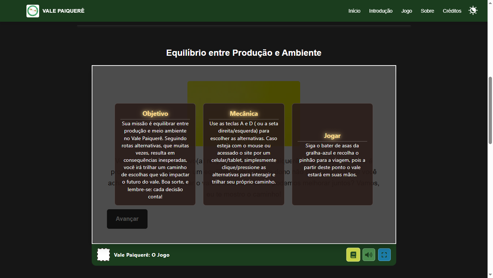
    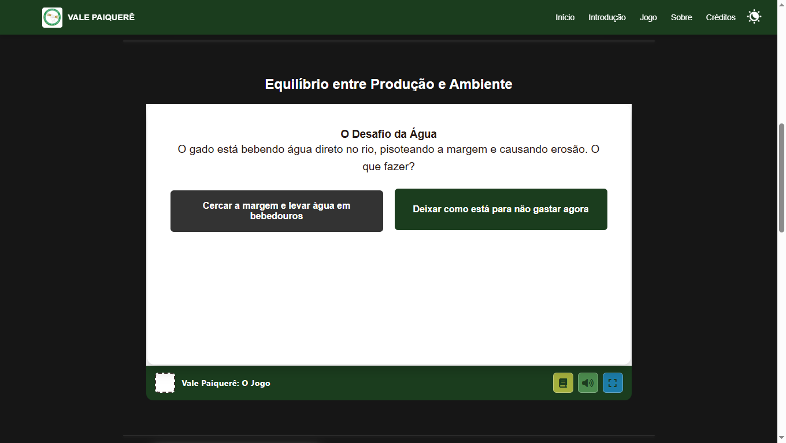

---

# Dia 24 — 19/05/2026

__Resumo:__ Hoje acabei dando umas arrumadas nas proporções das imagens, botões, cars e texto do jogo. Terminei de fazer a lógica 1 = 2 = 4 = 8 = 16 = 32 = 17 como comentado que eu faria — desculpe se eu ter errado na lógica, pois é bastante e mesmo com a gemini como assitente, acabei de confundindo pelo tamanho. 

__Atividades do dia:__

— Terminar o roteiro do jogo.

— Arrumar as proporções dos elementos do jogo.

— Colcoar uns detalhes de brilho e mudança de tamanho.

— Retirar alguns títulos do site que estavam atrapalhando.

— Fazer uma adição para o botão avançar quando chegar no final.

__Uso de IA e Decisões Técnicas:__

— __Prompt(s) Utilizado(s):__

**Prompt 1:** continue o código:

(A lógica do código que eu fiz, sendo aquele do Nível 2)

Continue seguinto o mesmo sentido, e lembre, é 1 = 2 = 4 = 8 = 16, que quer dizer que, nessa parte estamos no nivel 3, sendo oito perguntas, dezesseis escolhas e dezesseis caminhos. Mas por enquanto vamos focar em fazer as oito perguntas com duas escolhas cada, como mencionado, fazendo cada um dessas escolhas terem um resultado diferente, entendeu? siga o comando acima como base da base, respeitando-os.

**Demais promps:**Eles seguiram o mesmo padrão, apenas mudando uns dados de quanstas perguntas, caminhos e qual o nível que ele teria que continuar, além de algumas adições que fui fazendo — convenhamos, poupei bastante tempo, pois eu teria que fizar repetindo a mesma estrutura de código.

— __Refinamento manual:__ Como falei no ínicio dessa anotação, mesmo que a IA (gemini) tenha me ajudado a poupar tempo repetindo o mesmo comando, ainda fiquei meio confusão, e acabei observando uns erros no meu principal código que estava como base para a gemini — resultando em refazer o nível 4 ou 3, nem me recordo esatamente. 

__Próximo passo:__ Refazer o roteiro que a IA distribuiu para as alternativas, colocar imagens, e se sobrar tempo amanhã após tudo isso, já começo a arrumar a proporção para os celulares.

__Nota:__ As vezes o orgulho pode te colocar em ruínas, então melhor aceitar que a IA (gemini) consegue te ajudar em certas pares do que perder tempo em partes que não terão tanta relevancia afinal — focando no design e experiência da pessoa.

__Imagem(s):__ As imagens de hoje monstram como está o jogo a noite e de dia:

    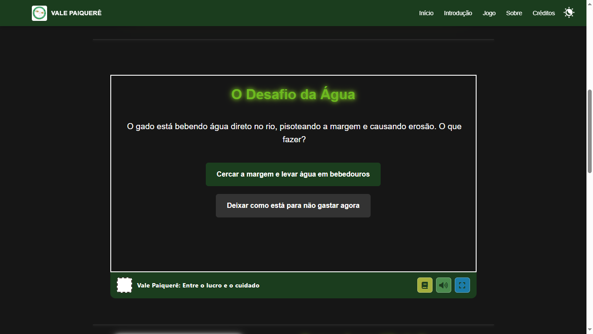
    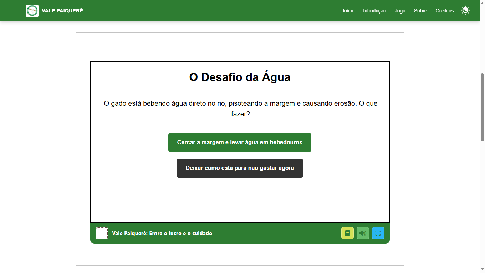
    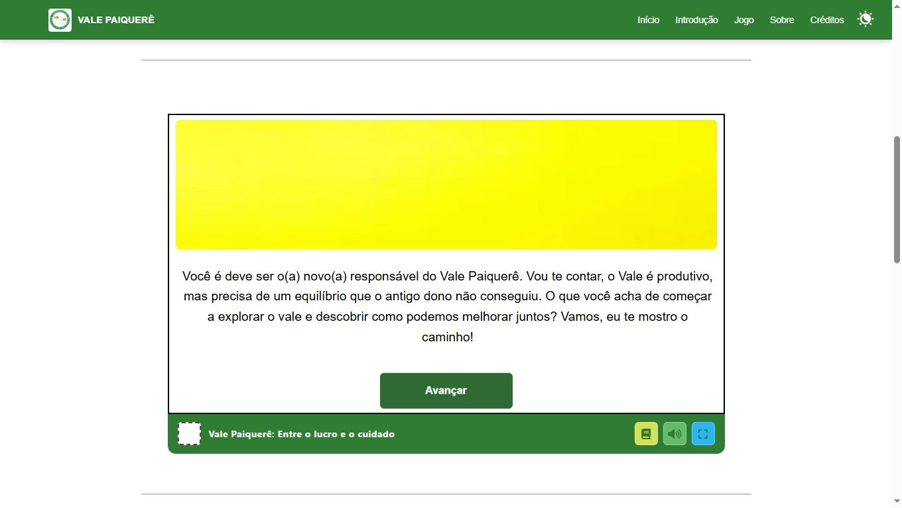

---

# Dia 25/28 — 20/05/2026 - 23/05/2026

__Resumo:__ Durante esse tempo dessa vez eu não descansei, eu fiz o roteiro, poli ele, refiz, ajustei umas partes e bugs para o modelo de pc, por final, deixei mais elegante o site.

__Atividades desses dias:__

— Fazer o roteiro do jogo.

— Arrumar o roteiro do jogo.

— Colocar a imagens.

— Arrumar a proporção da imagem, título, botão e texto.

— Fazer lógica das alternativas mudarem de ordem — AB ou BA.

— Não foi bem uma atividade, mas eu assisti aquele vídeo do Aluro sobre o agrinho 2026 que vocês mandaram, que resultou em uma adição:

— Colocar imagens laterais.

— Colocar imagens laterais no modo noturno.

— Fazer a lógica da troca de imagens.

— Arrumar os bugs — ainda tem erros de proporções para celulares... meu Deus, esse projeto não acaba nunca.

__Uso de IA e Decisões Técnicas:__

— __Prompt(s) Utilizado(s):__ Para gerar as imagens de cada resultado eu usei o próprio texto/roteiro, a única coisa que podemos falar que tenho que documentar é o padrão do meu pedido:

**Prompt 1:** Continur o código: (código do momento, mas iniciou com o nível 1 e 2 que eu tinha feito manualmente)
[...]
(continue seguinto o mesmo sentido, e lembre, é 1 = 2 = 4 = 8 = 16, que quer dizer que, nessa parte estamos no nivel 5, sendo oito perguntas, dezesseis escolhas e dezesseis caminhos. Mas por enquanto vamos focar em fazer as oito perguntas com duas escolhas cada, como mencionado, fazendo cada um dessas escolhas terem um resultado diferente, entendeu? siga o comando acima como base da base, respeitando-os.)

**Prompt 2:** Faz uma imagem do zero, seguinto o contexto do reteiro com a medida da imagem sendo de 800px (width) por 200px (height). Vou repetir, respeitando o roteiro: [...]

**Prompt 3:** Faz uma imagem do zero, seguinto o contexto do reteiro com a medida da imagem sendo de 800px (width) por 200px (height). Vou repetir, respeitando o roteiro (imagem realista e cinematográfico, pois será a última imagem): [...]

**Prompt 4 (ChatGPT):** Não tenho o prompt exato, mas eu pedi para o chat escurecer/deixar de noite a foto que a gemini gerou para mim. Por quê? Porquê a gemini não estava conseguindo fazer esse meu pedido, então pedi para o chat e ele conseguiu.

Esse foi os dias que mais usei a IA (gemini e chatGPT) para fazer imagens.
 
— __Refinamento manual:__ Podemos falar que o refinamento manual foi refazer o roteiro que a IA inicialmente tinho mandado como exemplo/trilogia como base. Levei realmente três (3) dias só nessa parte, ainda cortei mais dois (2) caminhos, pois inicialmente era multiplicando os resultados por dois (2), resultando em uma pergunta dois caminhos, sendo assim: 1 = 2 = 4 = 8 [...]
As imagens das laterais surgiram quando eu vi um vídeo do Alura como informado, como a moça lá falou: "Quando a pessoa abre o site, ela já vai entender o que você vai falar apenas com o desing?". Não fui muito longe, mas adicionei algumas imagens nas laterais, no modo claro e escuro (que me levou o dia todo para conseguir a mesma proporção de imagens totalmente diferentes... mas agora eu sei como conseguir), afinal, esse tipo de imagem irá aparecer apenas para pcs e alguns tablets, como falei, em algumas ocasiões como celulares, mesnos é mais.
Então entendam, em algumas partes vocês podem persar que estou sendo inrresponsável, mas na real, estou sendo sensato e realista com o reconhecimento e prazo que tenho. Pois ainda tenho que reajustar todo o jogo no celular, e pequenos ajuste no tablet (junto a imagem das laterais), então, menos é mais em algumas partes, o que importa é que as estrelas principais funcionam: Diálogo com a Gralha-Azul, Jogo de escolhas realistas e que deixam a pessoa pensando, e por final, um fragmento de jornal no final — não esquecendo dos créditos no final junto a logo de minha escola.

__Próximo passo:__ Com tudo feito, mesmo que eu queira fazer mais coisas e demais, na parte do computador (pc) agora só falta as adições finais, como as imagens das ferrametas usadas, um micro ajuste em um bug escondido (provavelmente vocês não iriam/vão perceber, mas é fatal), alguns testes finais, remoção de algumas coisas e por final (se sobrar tempo) vou mudar o título inicial por algo mais chamativo ou algo do gênero, como a moça do vídeo do Alura falou.
Por outro lado no celuar (600px) já é outro assunto: Está um cenário de semi-anarquia hahaha (o riso é de nervoso), por sorte é apenas na parte do jogo que eu já sei o que fazer, que vocês logo descobrirão/já devem ter visto ai no futuro. E sobre as imagens laterais... ainda não terá, mas vou recompensar com algo ou não, pois o prazo está acabando — mas seria uns vagalumes e/ou copas de araucárias.

__Nota:__ Hoje não tenho nada a notar, apenas um fato/defesa: Eu usei a IA durante esses dias pois iria repetir muito o código das escolhas. E sobre o que eu falei: "Vou deixar a parte criativa para mim, imagens e texto por exemplo". Completei parcialmente ou completamente, pois eu sou familiarizado com pixel art, então para as escolhas ficariam legal, mas não sensacional. Mas os textos eu fiz questão de fazer um por um, por isso minha demora até para documentar, levei muito tempo só para isso...

__Imagem(s):__ Eu acho que será a primeira vez (ou não, haha) que mostro meu erro, que já resolvi a respeito das imagens laterais. Mas a seguir, como está o site:

    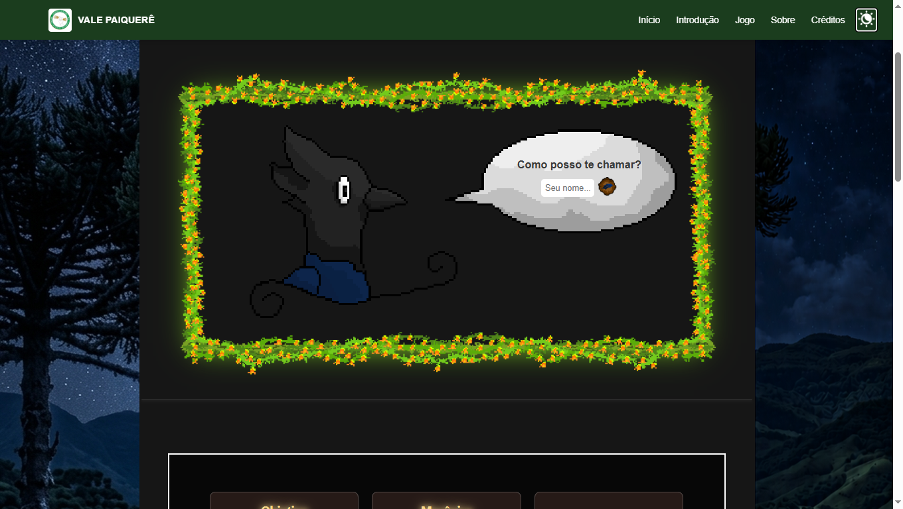
    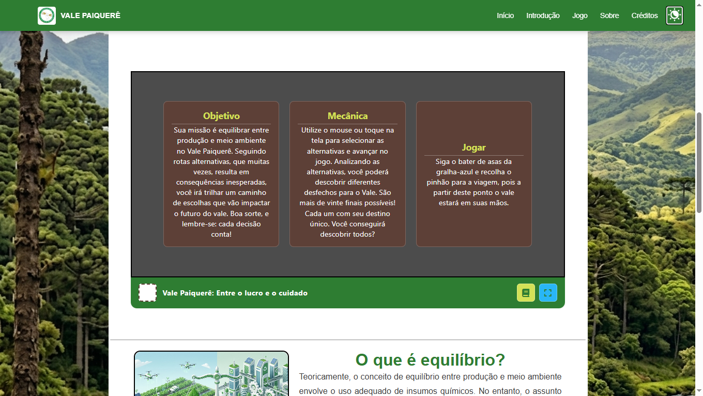
    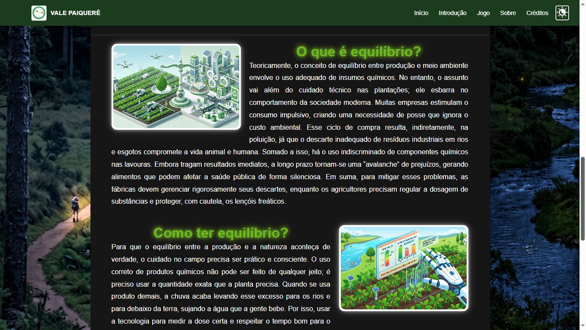
    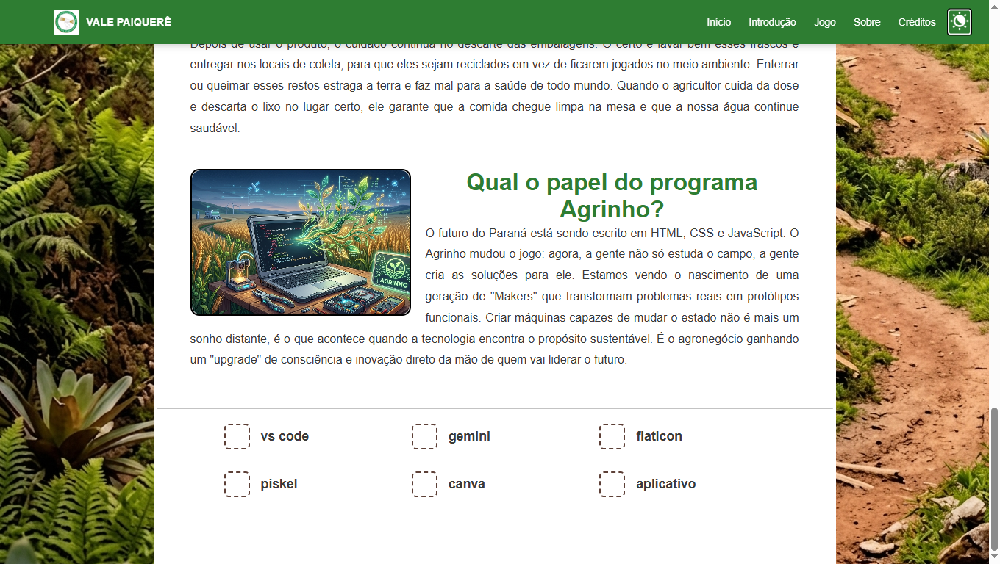

Agora como está o bug no celular:

    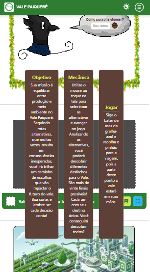

Devido as quedas de energia, acabou-se que terminei essa documentação dos dias 25/28 só no dia seguinte, isso significa que já estamos no dia 29, seguindo o calendário hoje é 24/05/2026, então talvez hoje não tenha documentação, pois os problemas são muitos, e tenho que resolve-los.

---

# Dia 29/30 — 24/05/2026 - 25/05/2026

__Resumo:__ Me sinto transbordado por uma alegria instavel, pois hoje eu terminei o site em geral, do ínicio aos créditos, aos bugs a elegância. Porém ainda tenho polimento a fazer: estravagância no título inicial, um micro ajuste no véu do jogo e por final estou a pensar em araucárias nos celulares e tablets para compensar as imagens laterais retiradas — enquando ao modo escuro... vagalumes.
Ainda terei que testar meu código no site que vocês desejam, pode ocorrer algum erro — segundo o professor. Por final, testar o site em uma tablet real.  

__Atividades do dia:__

— Resolvi o bug do jogo no celular, isso custou algumas horas — umas duas a quatro talvez. Ao invés de marcar cada a ação que preencherá essa ala de atividades, eu menciono que foi muitos ajustes, sendo prova o "Ajuste do jogo em telas menores" que eu fiz tudo hoje.
Em outras palavras: Quase refiz o jogo inteiro nas telas 600px.

— Coloquei imagens nos créditos e adicionei o último integrante que faltava: ChatGPT, ajudante nas imagens noturnas apenas.

— Retirei alguns bugs no computador, realacionado a imagens laterais, simples, mas deselegante.

— Removi as images laterais nos tablets, isso espero.

— Redevini um micro ajuste na posição do botã escurecer nos tablets.

— Pequenos ajustes, que provavelmente não vou me lembrar.

__Uso de IA e Decisões Técnicas:__

— __Prompt(s) Utilizado(s):__ Entre esses dois dias eu não pedi nada considerável prompt de comando ou geração de algo, apenas um: que eu pedi a logo da Gemini para a própria — pois eu não encontrava.

— __Refinamento manual:__ Tudo que podes observar fui eu. Aquela amontuado de linhas cheias de comandos e lógica, eu que fiz, como eu disse no ínicio do arquivo: "sou bom em padrões" e com isso, o passar desses dias, eu consigo montar meus códigos com mais facilidade com menas assistência técnica da IA, específicamente Gemini.
Os ajustes gerais fui por minha conta, enquanto as imagens eu peguei direto com os sites, usando o botão direito e acessando as propriedades, eu consigui abaixar as imagens originais de casa aplicatico usado.
Outrossim, parece pouco esse me tal ajuste, mas pense comigo: ainda sou um mero estudante que não se sente atraído pela lógica da programação, que ama a literatura atualmente, porém esse tal estudante aceitou enfrentar o desafio da programação, mesmo apenas sabendo o básico. 

__Próximo passo:__ Meu próximos passos será o polimento, fazendo um título inicial mais estravagante, arrumar o micro-bug do jogo, recompensar os celulares e tablets por não terem as imagens laterais (mais uma vez, eu não estou sendo inrresponsável, apenas sensato com a realidade e prazo atual), testar o site em tablets, adicionar um botão no jogo de aumentar o texto (apenas para celulares e estou a pensar para os tablets), e assim por diante, vou pensando no polimento até lá.

__Nota:__ Sempre programa com a cabeça livre, eu falo que não se estreçar ou apavorar. Pois é questão de tempo para você compreender a simplicidade do erro cometido: recomendo ouvir uma música igual a mim durante esses trinta dias.

__Imagem(s):__ Sinto orgulho em mostrar como está nos celulares o site:

    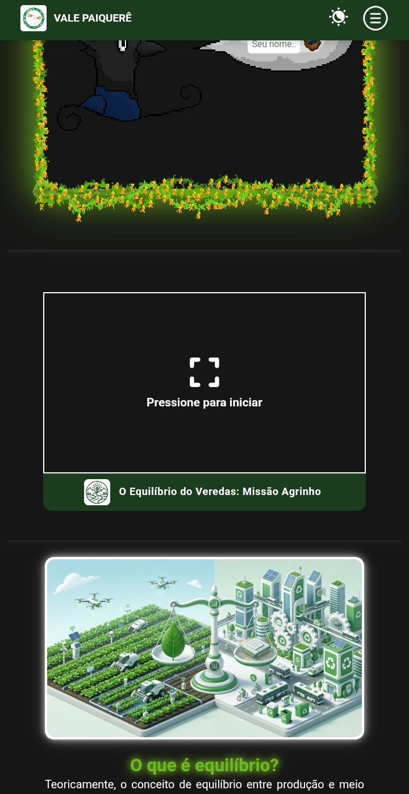
    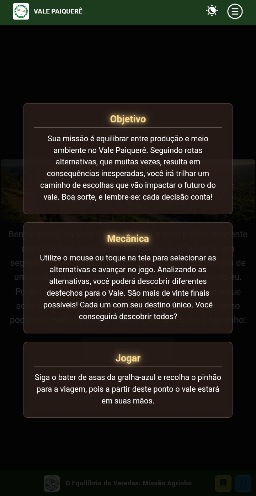
    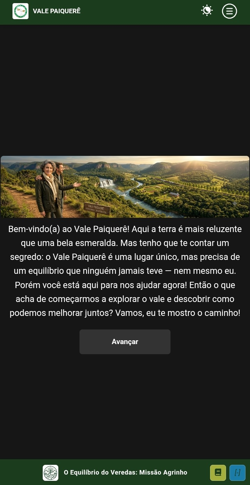
    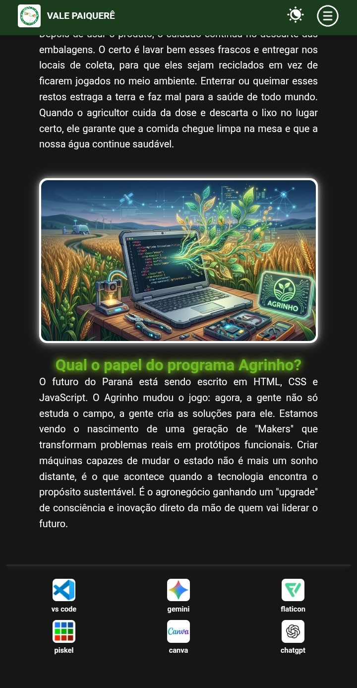

---

# Dia 31/33 — 26/05/2026 - 28/05/2026

__Resumo:__ Finalmente terminei o site, resolvi os bugs que estavam a amostra — comprometendo minha pontuação — ajustes para melhor acessibilidade ao usuário — como a expanção do jogo em telas 600px — adições para melhor esperiência — sendo os vagalumes, conpensando a falta das imagens laterais, que iriam poluir o site em telas menores como tablets e celulares.

__Atividades dos últimos dias:__

— Resolver bugs, específicamente esses: jogo atrás do véu (tablets e computadores), console do site a respeito das alternativas, imagens laterais (apenas computadores, que estavam sendo empuradas dependendo da alternativa escolhida) e arrumei demais problemas que apareciam a cada mudança/adição feita.

— Compensei os usuários de telas menores com vagalumes nas laterais.

— Mudanças de proporções e ajuste de margens dos elementos composto no site.

— Teste geral, faltando apenas postar no "Git" — se eu não estiver enganado — acabando minha documetação por aqui e hoje — eu espero.

__Uso de IA e Decisões Técnicas:__

— __Prompt(s) Utilizado(s):__ Sem utilidades, por conta que foi ajustes de erros, uma condição que a IA ainda não consegue realizar — como discutido com o professor: "A IA aplica problemas mais complexos para encobrir os demais bugs".

— __Refinamento manual:__ Total. Como comentado logo acima, durante esses dias foi mais polimento, mesmo assim eu acabei atrasando, pois na terça-feira passada eu acabei tendo que passar uma parte de meu dia — uma boa parte — decorando e arrumando a sala de aula para apresentação — projeto da Geografia/História/Artes do Paraná.

__Próximo passo:__ Mesmo com tudo pronto, ainda não pude testar em tablets, e ainda falta fazer os resumos semanais formais e ademais sobre a documentação — sem contar em postar o projeto e comferir se não terá nemhum erro.

__Nota:__ Provavelmente eu ficarei de ressaca a respeito a programação de sites.

__Imagem(s):__ A seguir, como ficou o bug corrigido e adição dos vagalumes:

    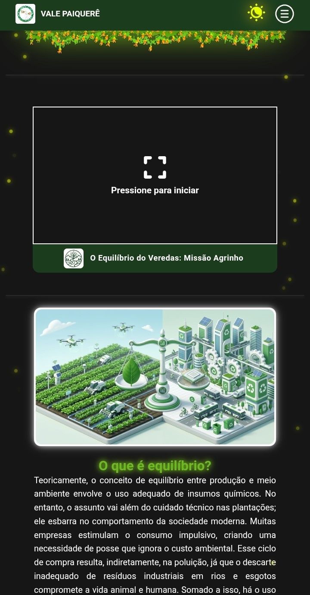
    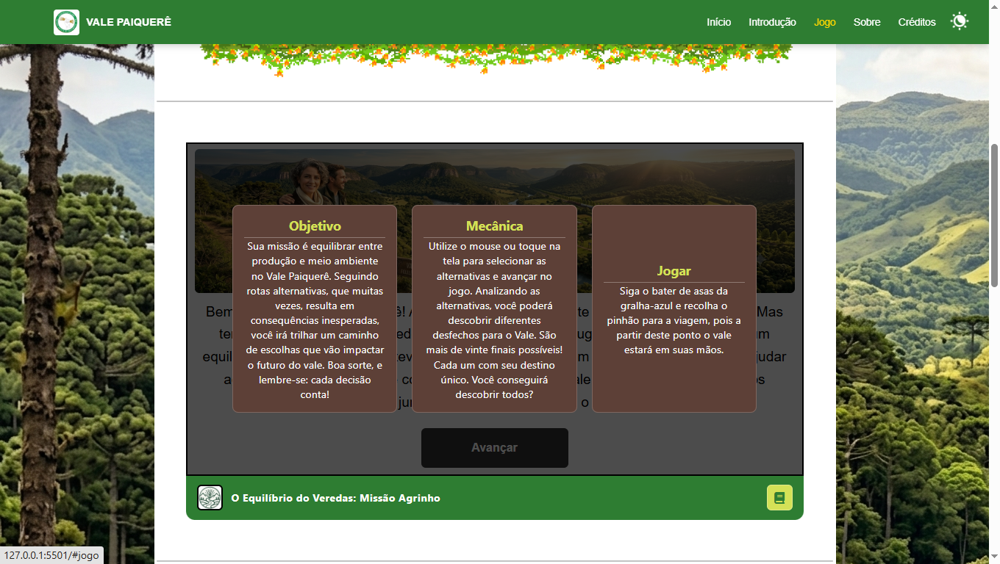

---

# Dia 34/35 — 29/05/2026 - 30/05/2026

__Resumo:__ Eu pensava que a partir desses últimos dias nesse poço sem fim de programação seria finalmente água limpa, porém quando fui mais assundo a respeito do polimento, descobri que ainda existia água barrenta — bugs. Durante esses dias venho arrumando vários bugs de proporções de telas, afinal, pessoas que tem celulares com telas de 320px também merecem acessar o site, mesma coisa para pessoas que gostam de jogar no modo paissagem — fiz o que estava em meu alcance atual.

__Atividades nos últimos dias__

— Em geral, arrumar erros de proporções, limpando erros de console, consultando a edital inúmeras vezes e reasistindo a aula do alura — conferindo se não fiz nada de errado.

__Uso de IA e Decisões Técnicas:__ 

— __Prompt(s) Utilizado(s):__ Nenhum novamente, pois ajuste de bugs, console, proporções e ademais é realizado manualmente.

— __Refinamento manual:__ Total, pois eu fico me incomodando com erros muito discarados, mesmo que tenha pequenos erros, eu tento arrumar.

__Próximo passo:__ Revisar novamente os códigos em diferentes aparelhos, testar todas as funções com combinações malucas e possíveis, e por final, revisar a documentação a respeito na introdução/inico.

__Nota:__ Sempre testar o site antes de qualquer coisa, quero dizer, antes de postar ou apostar nele.

__Imagem(s):__ Imagens anuladas, pois não são úteis por agora, já que o problema está em refinamento, então não existe algo interessante.

---

# Dia 36/40 - 31/05/2026 — 04/06/2026

__Resumo:__ Acabei tendo que resolver alguns bugs, adições e testar algumas funcionalidaes, não impactantes, mas essenciais.

__Atividades desses dias:__

— Arrumar bugs (principalmente o erro 404.)

— Ajustar proporções e revisões.

— Adição do rodapé.

— Adição da % (porcentagem) em alguns textos e proporções.

— E pequenos a médios bugs que apareceram.

__Uso de IA e Decisões Técnicas:__

— __Prompt(s) Utilizado(s):__ Nenhum, pois era apenas refinamento e uso de componentes/estrutura já feitos antes.

— __Refinamento manual:__ Total, pois mesmo com estruturas prontas, eu tive que ajustá-las para melhor legibilidade em computadores e smartphones.

__Próximo passo:__ Revisar tudo novamente, conferindo se não tem bug ou falha fatal.

__Imagem(s):__ Não tem, como eu disse, agora é apenas revisão cansativa.

# Nota: Nos vemos em... Curitiba?

---

# A seguir, o padrão de estrutura usada na documentação:

**___Dia 00 — 00/00/2026___**

__Resumo:__

__Atividades do dia:__

__Uso de IA e Decisões Técnicas:__

— __Prompt(s) Utilizado(s):__

— __Refinamento manual:__

__Próximo passo:__

__Nota:__
Comentário

__Imagem(s):__
